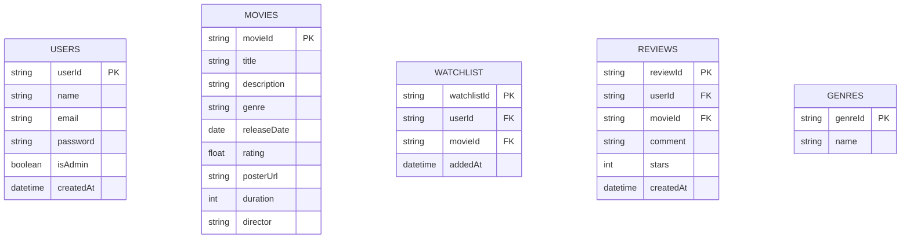

# 🎬 Movie Ratings & Reviews Project  

A full-stack MERN-style application for movie enthusiasts to browse, review, and manage favorite films. Built with **React.js** frontend and **Node.js + Express + Sequelize (MySQL)** backend.

## ✨ Features  
- **🔐 Authentication**: JWT-based user registration/login with role-based access (user/admin)  
- **🎥 Movie Management**: Add/edit movies (admin), browse details with posters/ratings  
- **💬 Reviews**: Post, edit, or delete star-rated reviews  
- **⭐ Favorites**: Save/unsave movies to personal collection  
- **📅 Showtimes**: View and book theater showtimes (admin-seeded data)  
- **🎨 Responsive UI**: Modern React interface with SCSS styling  

## 🛠 Tech Stack  
**Frontend**: React.js, React Router, Axios, SCSS  
**Backend**: Node.js, Express.js, Sequelize ORM  
**Database**: MySQL  
**Authentication**: JWT, bcrypt  
**Utilities**: UUID, Day.js, Toastify  

## 🚀 Installation  
1. **Clone repository**  
```bash
git clone https://github.com/Harshita-2205/Ratings-and-Reviews_project.git
cd Ratings-and-Reviews_project
```
2. **Backend Setup**
 ```bash
cd backend
npm install
```
Create .env file in the backend directory:
```bash
DB_NAME=test
DB_USER=root
DB_PASS=yourpassword
JWT_SECRET=your_jwt_secret
```
Initialize database and seed with sample data:
```bash
node seed.js
```

Start backend server:
```bash
npm run dev
# Server runs on http://localhost:5000
```
3. **Frontend Setup**
 ```bash
 cd ../frontend
 npm install
 npm start
 # Frontend runs on http://localhost:3000
   ```
## 📂 Project Structure

```bash
backend/
├── controllers/  # Logic handlers
├── middleware/   # Auth & validation
├── models/       # Sequelize models
├── routes/       # API endpoints
└── seed.js       # Dummy data generator
frontend/
├── src/
│   ├── components/  # UI components
│   ├── pages/       # View pages
│   ├── utils/       # Helpers
│   └── App.jsx      # Main router
```
## 🌐 API Endpoints
```bash
Endpoint	Method	Description	Access
/api/auth/register	POST	User registration	Public
/api/auth/login	POST	User login	Public
/api/movie/getMovies	GET	List all movies	Public
/api/movie/addMovie	POST	Add new movie	Admin
/api/review/addreview	POST	Add movie review	User
/api/favorite/savemovie	POST	Save to favorites	User
```
## 🧪 Test Credentials
Admin:
email: admin@example.com
password: admin123

User:
email: user@example.com
password: user123

Sample Movies: Inception, Interstellar, The Dark Knight

## Database Schema: SQL Schema/ER diagram

### 📝 Description of Tables

- **USERS** – Users of the platform (viewers or admins).
- **MOVIES** – Main catalog of movies.
- **REVIEWS** – User-submitted reviews for each movie.
- **WATCHLIST** – Personal watchlist/favorites saved by each user.
- **GENRES** – Genre categorization (optional separate table if normalized).

  
## 🤝 Contributing
1.Fork the repository

2.Create your feature branch (git checkout -b feature/AmazingFeature)

3.Commit changes (git commit -m 'Add feature')

4.Push to branch (git push origin feature/AmazingFeature)

5.pen a Pull Request

## 📜 License
MIT License

## 👩‍💻 Author
Harshita Baghel

📧 harshitabaghel2005@gmail.com

